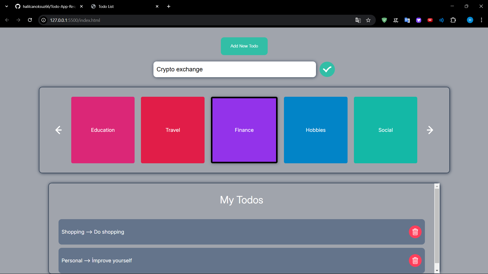
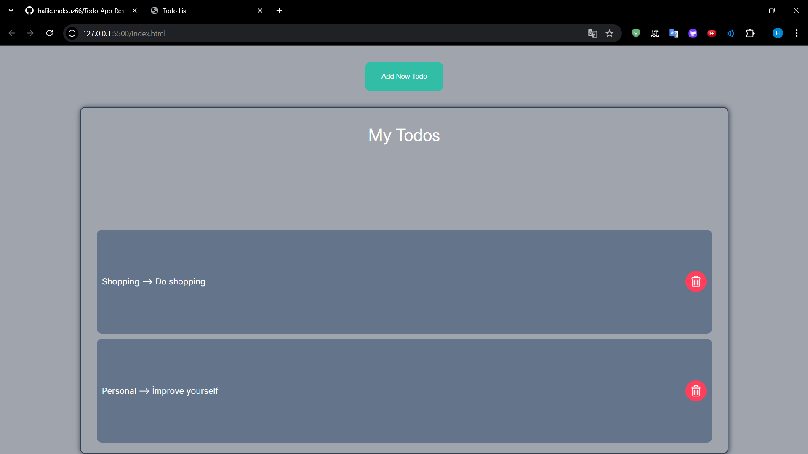

# Todo List Uygulaması

Bu proje, basit bir Todo List uygulamasıdır. Kullanıcılar, görevler ekleyebilir, kategorilere ayırabilir ve görevleri silebilir. Ayrıca, responsive tasarımı sayesinde mobil ve masaüstü cihazlarda düzgün çalışacak şekilde optimize edilmiştir.

## 📸 Ekran Görüntüleri

### Ana Sayfa

*Kategori ekleyebileceğiniz ve yeni todo ekleyebileceğiniz Todo List arayüzü.*

### Kategorilere Göre Todo Listesi

*Seçilen kategoriye yeni bir todo eklenmiş Todo List arayüzü.*

## 🚀 Özellikler

- **Kategori Yönetimi:** Kategoriler (Work, Personal, Shopping, Health vb.) eklenebilir ve seçilebilir.
- **Todo Ekleme:** Seçilen kategoriye göre yeni todo'lar eklenebilir.
- **Todo Silme:** Eklenen todo'lar silinebilir.
- **Responsive Tasarım:** Uygulama, mobil ve masaüstü cihazlar için optimize edilmiştir.

## 🛠 Kullanılan Teknolojiler

- **Frontend:** HTML, CSS, JavaScript
- **Veri Yönetimi:** LocalStorage (Todo'ları kaydetmek için)
  
## 📂 Proje Yapısı

### `index.html`
Ana HTML dosyasıdır. Burada, uygulamanın yapısal öğeleri (görev listesi, kategori butonları, input alanı vb.) bulunur.

### `styles.css`
Uygulamanın stil dosyasıdır. Renkler, butonlar, yazı tipleri ve düzenleme için stiller burada tanımlanmıştır.

### `utils/utils.js`
Yardımcı fonksiyonların yer aldığı dosya. Burada, Todo listesi yüksekliğini dinamik olarak ayarlayan fonksiyon yer alır.

### `scripts/categories.js`
Kategoriler ile ilgili işlemleri yöneten dosyadır. Kategorilerin güncellenmesi, seçilen kategorilerin yönetimi gibi işlemler burada yapılır.

### `scripts/eventHandlers.js`
Tüm etkileşimli olayları (kategori tıklama, görev ekleme, silme vb.) yöneten dosya.

### `scripts/my-todos.js`
Todo'ların eklenmesi, silinmesi ve localStorage'a kaydedilmesi işlemleri bu dosyada yapılır.

### `scripts/main.js`
Uygulama başlatıldığında gerekli başlangıç işlemleri ve event listener'lar burada tanımlanır.

## 📦 Kurulum

1. Bu projeyi bilgisayarınıza indirin veya bir Git deposuna klonlayın:
   ```bash
   git clone https://github.com/kullaniciadi/todo-list-app.git
   cd todo-list-app
